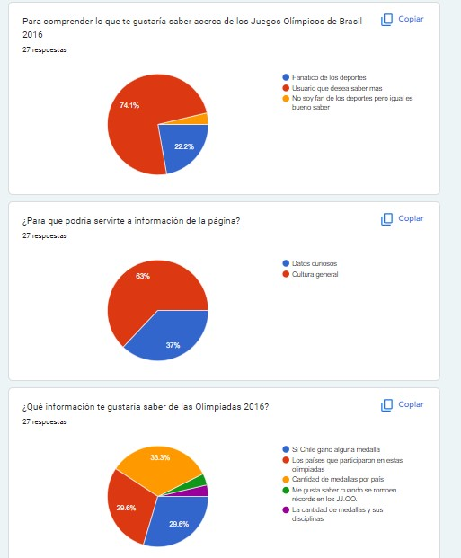

# Olimpíadas Rio 2016!
Hola, Somos **Daniela y Andréa**  estudiantes de    Laboratoria  SCL021.
Empezamos con la lectura de readme del proyecto, después pensamos en 2 historias de usuario lo que nos ayudo
a pensar en como debería ser nuestra pagina y sus funcionalidades.
Seguimos los tips de priorizar a cada sprint,  tener pequeños avances y entender lo que hacíamos.
Ocupamos para organizarnos la herramienta **Trello** con eso a cada **sprint planining** teníamos claro lo que deberíamos hacer para lograr nuestro objetivo.
Tuvimos  la fortuna de ser acompañadas por los coach, ocupamos muy bien la **O.H**(Office Hours) en ese proyecto.
Fue una hermosa oportunidad de trabajar en compañerismo y aprender de los desafíos de administrar el tiempo junto a excelente comunicación y siempre priorizando la auto-gestión y el aprendizaje de cada una a su ritmo, disfrutamos de las oportunidades de compartir y disfrutar también a medida que avanzamos en el proyecto, destacamos la  buena **comunicación**  a cada sprint planning .
# Historia de Usuario
Hicimos una encuesta para saber mejor lo que nuestro usuario le gustaría de tener en nuestra pagina, con las respuestas empezamos a desarrollar nuestro prototipo de baja fidelidad y las historia de usuario.

## Historia de usuario
Siguiendo la metodología de **(yo, como y para)** creamos nuestra historia, priorizando los criterios de Aceptación para cada una.
## Prototipo de baja fidelidad
 Durante el proyecto haber hecho nuestro prototipo de baja fidelidad ayudo para pedir  feedback y también a saber como deberíamos hacer el filtro ya que nuestras historias de usuario fue nuestra prioridad.
 Seguimos avanzando e iteramos muchas veces pensando siempre en la mejor usabilidad para nuestro usuario. Durante el proceso de creación tuvimos feedback de nuestras compañeras durante los Sprint y también en las **Demos** , dando la oportunidad de hacer cambios.

## Prototipo de Alta fidelidad
Siguiendo la orientación del readme hicimos nuestro prototipo de alta fidelidad ocupando figma.
Hubo cambios en medio del proyecto por medio de feedback de nuestras compañeras y coach, hicimos esos cambios que se puede ver mas abajo en el prototipo.

## Pruebas Unitarias
En ese proyecto priorizamos que a cada filtro estuviera  funcionando y pasará los test.
     linter (`npm run pretest`)
     tests (`npm test`)
  Hicimos las pruebas pertinentes y pasan
# Consideraciones Finales
Una gran oportunidad de desarrollar Life Skills y aprender a nuestro ritmo , como compañeras estuvimos siempre buscando la mejor manera de avanzar , cuidando de auto-cuidado y también iteramos muchas veces para quedar claro el camino, hicimos cambios significativos en **tercer sprint** con las imágenes que estábamos ocupando porque tuvimos el regalo de muchas de nuestras compañeras a darnos el feedback, cambiando el diseño de nuestra pagina , pero siempre siguiendo las historias de usuario.
Sin dudas ganamos muchos conocimientos en este proyecto, tantos técnicos y para la vida .
Que gran oportunidad poder hacer parte de esa generación de estudiantes de **Laboratoria**
# Publication
https://github.com/dreasantos51/SCL021-data-lovers.git
https://github.com/daniela-paz-espinoza/SCL021-data-lovers.git